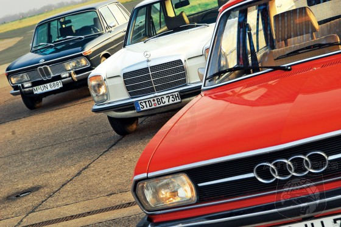
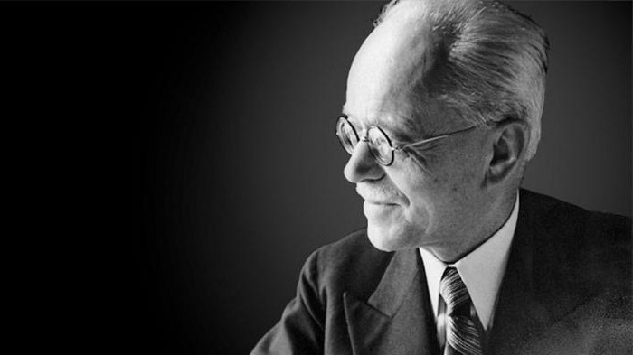
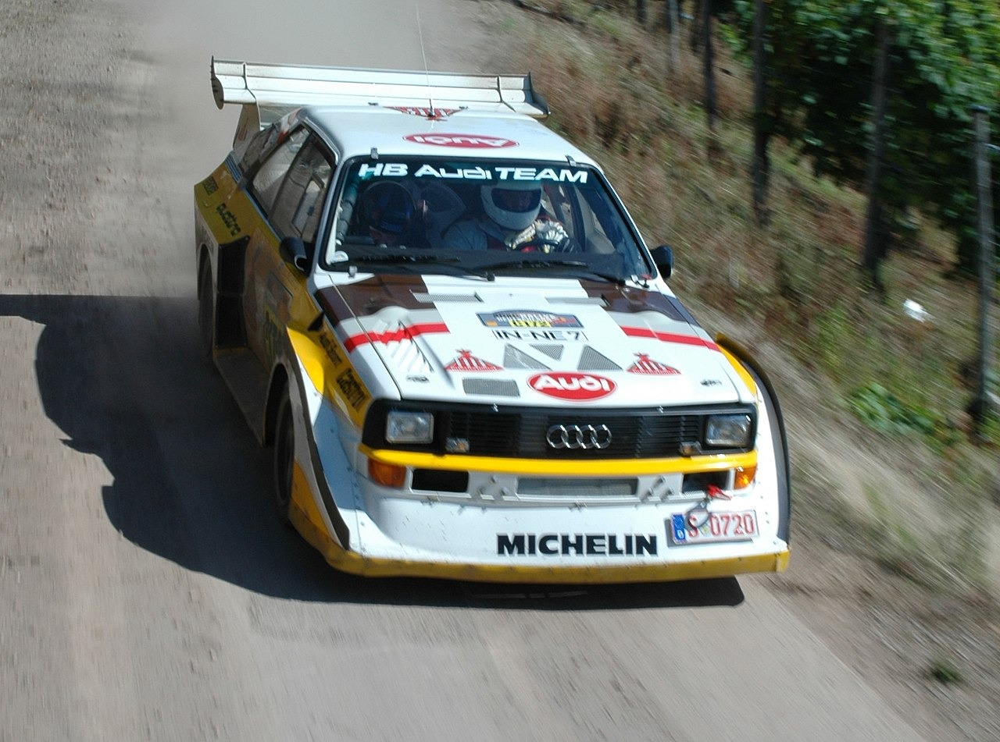

# pract
<!DOCTYPE html>
<html lang="en">

<head>
    <title>Document</title>
    <link rel="stylesheet" href="style.css">
</head>

<body>
    <h1>AUDI</h1>
    
Audi — немецкая автомобилестроительная компания в составе концерна Volkswagen Group, специализирующаяся на
        выпуске автомобилей под маркой Audi.

    <ol>
        <li>
            <a href="#history">История</a>
        </li>
        <li>
            <a href="#founder">Основатель</a>
        </li>
        <li>
            <a href="#competition">Конкуренция</a>
        </li>
    </ol>
    

        <h2 id="history">История</h2>
        
        
Audi в нынешнем виде является наследником концерна Auto Union, образованного в результате объединения четырёх
            компаний, выпускавших автомобили и мотоциклы под марками DKW, Horch, Audi и Wanderer. Вследствие
            преобразований была оставлена лишь торговая марка Audi[3][5]. Первый автомобиль марки Wanderer появился в
            1913 году, первое собственное предприятие (Horch & Co.) Август Хорьх организовал в 1899 году, а после того,
            как кредиторы отстранили его от дел, в 1909 году была организована компания Audi Automobil-Werke, что
            переводится как «Автомобильный завод Ауди». А в 1910 году был выпущен первый автомобиль. В переводе с
            немецкого Хорьх (нем. Horch) означает «слушай». Когда выбирали название для новой марки, сын одного из
            деловых партнёров Августа предложил перевести фамилию основателя на латынь, то есть Audi — повелительное
            наклонение II лица единственного числа глагола audire (в переводе с лат. — «слушать»)[3]. В 1921 году фирма
            совершила своеобразный прорыв. В этом году был выпущен первый немецкий автомобиль с левосторонним
            расположением рулевого управления. До этого фирма занималась лишь двигателями и подвесками, теперь же она
            стала обращать внимание и на удобство управления. В 1928 году эта марка была выкуплена мотопроизводителем
            DKW, и в 1931 году состоялся дебют автомобиля с передним приводом, DKW F1[6]. Содействовал этому мировой
            экономический кризис, начавшийся в 1929 году.

    

    

        <h2 id="founder">Основатель</h2>
        
        
Август Хорш (нем. August Horch; 12 октября 1868, Виннинген — 3 февраля 1951, Мюнхберг) — один из
            первопроходцев немецкой автомобильной промышленности, инженер-конструктор и предприниматель, основатель
            компаний Horch и Audi.

    

    

        <h2 id="competition">Конкуренция</h2>
        
        
Всем известно, что главными конкурентами Audi на автомобильном рынке являются компании Mercedes-Benz и BMW,
            так называемая «Немецкая Тройка». Многие думают, что рекламная война началась с плаката BMW в 2006 году, где
            компания BMW «мило» поздравляла Audi с победой в конкурсе «Машина года»-2006 в Южной Африке. Но нет, всё
            началось ещё в далёких 80-х годах, когда компания Audi выпустили рекламный ролик, где Audi 200 накручивает
            восьмёрки вокруг Mercedes-Benz E-Klasse (W124) и BMW 5-серии (E28)[16]. Буквально через год компания BMW
            выпустила ответный ролик, продемонстрировав свою новую модель BMW 5-серии (E34). В рекламном ролике BMW
            присутствует три автомобиля, все автомобили накрыты тремя полотнами. Первый автомобиль оказался BMW 5-серии,
            а остальные два автомобиля резко растворились и полотна, которыми они были накрыты упали на землю, это был
            намёк компаниям Audi и Mercedes-Benz. Компания Mercedes-Benz решила проигнорировать рекламы Audi и BMW, не
            отвечая им по сей день ничего. Рекламная война Audi и BMW продолжается до сих пор.

    

</body>
</html>
@import url('https://fonts.googleapis.com/css2?family=Oswald:wght@500&family=Ubuntu:wght@300&family=Unlock&display=swap');
body {
    font-family: 'Oswald', sans-serif;
    font-size: 20px;
    color: #fff;
    margin: 0;
    background: #3d3d3d;
    padding: 1rem;
    perspective: 1000px;
    overflow-x: hidden;
}
a {
    color: rgb(255, 0, 43);
    text-decoration: none;
    transition: all .5s;
    display: block;
    transform-origin: 0 50%;
}
div img {
    max-width: 20vw;
    max-height: 20vh;
    transition: all .5s;
    transform-origin: 0 50%;
}
h1 {
    margin-top: 0;
}
p:last-child {
    margin-bottom: 0;
}
div img:hover {
    transform: scale(1.5);
}
@keyframes show {
    0% {
        opacity: 0;
        transform: rotateX(-45deg) translateY(-20px);
    }
    100% {
        opacity: 1;
        transform: rotateX(0deg) translateY(0px);
    }
}
div {
    animation: show 1s forwards;
}
a:hover {
    transform: translateX(10px);
}
a:active {
    transform: scale(.9) translateX(10px);
}
